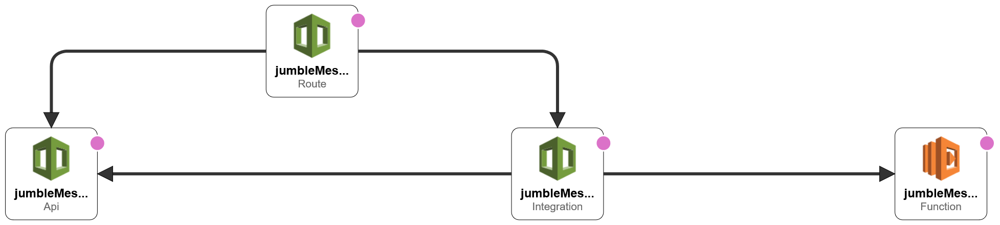

# Jumble Message API

## Endpoint

{BASE_URL}/api/jumble/{n}

| Event                            | Request                              | Status Code | Response                                           |
| -------------------------------- | ------------------------------------ | ----------- | -------------------------------------------------- |
| Successfully jumble a message    | `/1` <br> `{"message": "test 123!"}` | 200         | `{"jumbled": "uftu 123"}`                          |
| Not passing a body               | `/1` <br>                            | 400         | `{"message": "Missing body"}`                      |
| Not passing `message` body field | `/1` <br> `{"test": "test 123!"}`    | 400         | `{"message": "[Missing body property] - message"}` |
| Not passing `n` path parameter   | `/` <br> `{"message": "test 123!"}`  | 400         | `{"message": "[Missing path param] - n"}`          |
| Exceeding rate limiter           | `/1` <br> `{"message": "test 123!"}` | 429         | N/A                                                |

### Example

```bash
curl --request POST \
  --url {BASE_URL}/api/jumble/1 \
  --header 'Content-Type: application/json' \
  --data '{
	"message": "test 123"
}'
```

### Response:

```json
{
  "jumbled": "uftu 123"
}
```

### Response headers:

| Name                  | Value                         |
| --------------------- | ----------------------------- |
| **x-remaining-calls** | 299                           |
| date                  | Sat, 08 May 2021 01:17:34 GMT |
| content-type          | text/plain; charset=utf-8     |
| content-length        | 21                            |
| content-type          | text/plain; charset=utf-8     |
| apigw-requestid       | e_D69gC1SwMEMmA=              |

## Assumptions

- I assumed that the inputs could contain uppercase and lowercase alphabetical characters.
- I assumed that the inputs were only in English and did not consider latin alphabet.
- I assumed that there should be error handling in the endpoint when:
  - The `n` path parameter is not passed.
  - The JSON body doesn't exist.
  - There is no `message` field in the JSON body or it is an empty string.
  - The rate limiting is executed on both successful and bad requests.

## Solution stack

- [NodeJS](https://nodejs.org/en/) + [TypeScript](https://www.typescriptlang.org/)
  - Programming languages and runtime used to create the service.
- [AWS CDK](https://docs.aws.amazon.com/cdk/latest/guide/home.html)
  - For handling infrastructure and deployment as code.
- [AWS Lambda](https://aws.amazon.com/lambda/)
  - For creating the [controller](https://en.wikipedia.org/wiki/Model%E2%80%93view%E2%80%93controller) of the jumble service.
- [AWS API Gateway](https://aws.amazon.com/api-gateway/)
  - For creating a HTTP API that is used to invoke the Lambda function.
- [Docker](https://www.docker.com/)
  - For containerising the service.
- [Mocha](https://mochajs.org/)
  - For unit testing the service.

## Architecture

### IAM Policies

**Note**: This uses a wildcard (\*) on resources, it would be better to specify an ARN

```json
{
  "Version": "2012-10-17",
  "Statement": [
    {
      "Action": ["cloudformation:*"],
      "Resource": "*",
      "Effect": "Allow"
    },
    {
      "Condition": {
        "ForAnyValue:StringEquals": {
          "aws:CalledVia": ["cloudformation.amazonaws.com"]
        }
      },
      "Action": "*",
      "Resource": "*",
      "Effect": "Allow"
    },
    {
      "Action": "s3:*",
      "Resource": "arn:aws:s3:::cdktoolkit-stagingbucket-*",
      "Effect": "Allow"
    },
    {
      "Action": [
        "ecr:CreateRepository",
        "ecr:PutImageScanningConfiguration",
        "ecr:CompleteLayerUpload",
        "ecr:DescribeImages",
        "ecr:GetAuthorizationToken",
        "ecr:DescribeRepositories",
        "ecr:UploadLayerPart",
        "ecr:InitiateLayerUpload",
        "ecr:BatchCheckLayerAvailability",
        "ecr:PutImage"
      ],
      "Resource": "*",
      "Effect": "Allow"
    }
  ]
}
```

AWS CDK generates the following:

- An API Gateway that contains a route to `/api/jumble/{n}`
- An API Gateway & Lambda integration, such that the API Gateway endpoint above is a trigger for the lambda function.
- A lambda function that handles the logic and returns the jumbled message / appropriate response.



## Setting up development environment

### Prerequisites

- [NodeJS](https://nodejs.org/en/)
- [Yarn](https://yarnpkg.com/getting-started/install) - I prefer yarn over npm, due to:
  - Installation of packages from local cache.
  - Allows parallel package installation.
  - Facebook developed Yarn due to NPM's security and flexibility issues across different machines. See more [here](https://engineering.fb.com/2016/10/11/web/yarn-a-new-package-manager-for-javascript/):
    > Many of our projects at Facebook, like React, depend on code in the npm registry. However, as we scaled internally, we faced problems with consistency when installing dependencies across different machines and users, the amount of time it took to pull dependencies in, and had some security concerns with the way the npm client executes code from some of those dependencies automatically. We attempted to build solutions around these issues, but they often raised new issues themselves.
  - Yarn can also be run offline to install packages if you have installed them in the past.
- [Docker](https://docs.docker.com/get-docker/)
- [AWS CLI V2](https://docs.aws.amazon.com/cli/latest/userguide/install-cliv2.html) - installed and configured with a profile / user that has the above [policies][iam policies] mentioned.
- [AWS CDK CLI](https://docs.aws.amazon.com/cdk/latest/guide/cli.html)

### Installing all dependencies

1. Change directory into the root directory `/jumble-message-api` and install all root-level dependencies.

   Dependencies include:

   - [@aws-cdk/aws-apigatewayv2](https://docs.aws.amazon.com/cdk/api/latest/docs/aws-apigatewayv2-readme.html) - Set up AWS API Gateway HTTP, REST and WebSocket APIs programmatically.
   - [@aws-cdk/aws-apigatewayv2-integrations](https://docs.aws.amazon.com/cdk/api/latest/docs/aws-apigatewayv2-integrations-readme.html) - Set up integrations to connect routes to resources such as Lambda functions.
   - [@aws-cdk/aws-lambda](https://docs.aws.amazon.com/cdk/api/latest/docs/aws-lambda-readme.html) - Set up AWS Lambda Functions programmatically.
   - [@aws-cdk/core](https://docs.aws.amazon.com/cdk/api/latest/docs/core-readme.html) - Basic building blocks of the [AWS Cloud Development Kit](https://github.com/aws/aws-cdk) (AWS CDK).
   - [source-map-support](https://github.com/evanw/node-source-map-support#source-map-support) - Provides source map support for stack traces.

   Dev dependencies include:

   - [@types/node](https://www.npmjs.com/package/@types/node) - TypeScript definitions for Node.js.
   - [aws-cdk](https://github.com/aws/aws-cdk#aws-cloud-development-kit-aws-cdk) - CDK Toolkit, the command line tool for CDK apps.
   - [ts-node](https://github.com/TypeStrong/ts-node#installation) - TypeScript execution environment and REPL for node.js, with source map support.
   - [typescript](https://www.typescriptlang.org/) - TypeScript is a language for application scale JavaScript development.

   ```bash
   cd jumble-message-api
   yarn
   ```

2. Change directory into `/functions/jumble-api-function` and install the service's dependencies.

   Dev dependencies include:

   - [@types/aws-lambda](https://www.npmjs.com/package/@types/aws-lambda) - TypeScript definitions for AWS Lambda.
   - [@types/expect](https://www.npmjs.com/package/@types/expect) - Stub TypeScript definitions entry for [expect](https://www.npmjs.com/package/expect), which provides its own types definitions.
   - [@types/mocha](https://www.npmjs.com/package/@types/mocha) - TypeScript definitions for mocha
   - [esbuild](https://esbuild.github.io/) - An extremely fast JavaScript bundler and minifier.
   - [mocha](https://mochajs.org/) - Test framework running on Node.js and in the browser
   - [ts-mocha](https://github.com/piotrwitek/ts-mocha#ts-mocha) - Thin wrapper that allows running TypeScript tests with TypeScript runtime (ts-node) to get rid of compilation complexity
   - [typescript](https://www.typescriptlang.org/) - TypeScript is a language for application scale JavaScript development.

   ```bash
   cd functions/jumble-api-function
   yarn
   ```

### Running unit tests

1. Change directory into `/functions/jumble-api-function`

   ```bash
   cd functions/jumble-api-function
   ```

2. Run all unit tests with `yarn test`.

   ```bash
   yarn test
   ```

   Output

   ```bash
    $ yarn test
    yarn run v1.22.5
    $ ts-mocha __tests__/**/*.test.ts

      Jumble Message
        √ should return 'test 123' when ('test 123!', 0) is passed
        √ should return 'uftu 123' when ('test 123!', 1) is passed
        √ should return 'paop 123' when ('test 123!', 100) is passed
        √ should return 'test 123' when ('test 123!', 26) is passed
        √ should return 'Vguv 123' when ('Test 123!', 2) is passed

      Rate Limit
        √ should not reach limit and decrement 'remainingCalls' by 1, when a new IP is added
        √ should decrement 'remainingCalls' by 1, when an existing IP is found
        √ should reach limit when an existing IP calls more than the given maximum number within the given time frame
        √ should reset when an existing IP calls after the given time frame

      9 passing (12ms)

    Done in 0.71s.
   ```

### Locally building and running the service

The service can be locally built and ran using two shell scripts provided. This uses the [AWS Lambda Runtime Interface Emulator (RIE)](https://docs.aws.amazon.com/lambda/latest/dg/images-test.html).

1. Ensure that Docker is running on your computer and that ports `9080:8080` are not in-use.

2. Change directory into `/functions/jumble-api-function` if you are not already in this directory from the previous step.

   ```bash
   cd functions/jumble-api-function
   ```

3. Build the image by running the provided `local-build.sh` script:

   ```bash
   sh ./local-build.sh

   --- OR ---

   docker build -t jumble-service .
   ```

4. Invoke the image by running the provided `local-invoke.sh` script:

   ```bash
   sh ./local-invoke.sh

   --- OR ---

   docker run \
       --env AWS_ACCESS_KEY_ID="$(aws configure get default.aws_access_key_id)" \
       --env AWS_SECRET_ACCESS_KEY="$(aws configure get default.aws_secret_access_key)" \
       --env AWS_SESSION_TOKEN="$(aws configure get default.aws_session_token)" \
       --env AWS_REGION="$(aws configure get default.region)" \
       -p 9080:8080 \
       jumble-service dist/functions/jumbleMessage.index
   ```

5. You will now be able to test the function on this local endpoint:

   ```bash
   curl -XPOST "http://localhost:9080/2015-03-31/functions/function/invocations" -d '{}'
   ```

This only _emulates_ the endpoint, so any method will trigger this endpoint.

The response's status code will always be `200`, and headers will not be appended to the response, they will be shown in the response body instead.

If you would like to include the request path parameters and body, you will need to change the body payload to be:

```json
{
  "pathParameters": {
    "n": 1
  },
  "body": "{ \"message\": \"test 123!\" }"
}
```

This is following the shape of a Lambda proxy request which can be found in full detail [here](https://docs.aws.amazon.com/apigateway/latest/developerguide/set-up-lambda-proxy-integrations.html#api-gateway-simple-proxy-for-lambda-input-format).

#### **An example of testing the function locally**

#### **Successful Request**

Request:

```json
{
  "pathParameters": {
    "n": 1
  },
  "body": "{ \"message\": \"test 123!\" }"
}
```

Response:

```json
{
  "statusCode": 200,
  "body": "{\"jumbled\":\"uftu 123\"}",
  "headers": {
    "x-remaining-calls": 299
  }
}
```

#### **Bad Request - no path parameter passed**

Request:

```json
{
  "pathParameters": {},
  "body": "{ \"message\": \"test 123!\" }"
}
```

Response:

```json
{
  "statusCode": 400,
  "body": "{\"message\":\"[Missing path param] - `n`\"}",
  "headers": {
    "x-remaining-calls": 298
  }
}
```

## Deploying

1. Change directory back into the root directory `../../jumble-message-api` and build the project (this compiles TypeScript into JavaScript).

   ```bash
   cd ../../jumble-message-api or cd jumble-message-api
   ```

2. Build the root-level project (this compiles the TypeScript into JavaScript for CDK to read).

   ```bash
   yarn build
   ```

3. Bootstrap the environment for CDK.

   ```bash
   cdk bootstrap
   ```

4. Deploy the stack.

   ```bash
   cdk deploy
   ```

If you are running in a non-CI environment such as your local computer, it will give you a prompt to confirm the deployment, press `y` then enter to continue.

Output:

```bash
Do you wish to deploy these changes (y/n)? y

JumbleAPIStack: deploying...

[0%] start: Publishing 2d67bbb5d48cbd85c73442af4dede35c6631225f3f283e01e7410515c77b5891:current
[100%] success: Published 2d67bbb5d48cbd85c73442af4dede35c6631225f3f283e01e7410515c77b5891:current
JumbleAPIStack: creating CloudFormation changeset...
 0/9 | 11:14:11 AM | REVIEW_IN_PROGRESS   | AWS::CloudFormation::Stack     | JumbleAPIStack User Initiated
 0/9 | 11:14:16 AM | CREATE_IN_PROGRESS   | AWS::CloudFormation::Stack     | JumbleAPIStack User Initiated
 1/9 | 11:14:45 AM | CREATE_IN_PROGRESS   | AWS::IAM::Role                 | jumbleMessageFunction/ServiceRole (jumbleMessageFunctionServiceRole7CA42CB2)
 1/9 | 11:14:45 AM | CREATE_IN_PROGRESS   | AWS::CDK::Metadata             | CDKMetadata/Default (CDKMetadata)
 1/9 | 11:14:45 AM | CREATE_IN_PROGRESS   | AWS::ApiGatewayV2::Api         | jumbleMessageHttpApi (jumbleMessageHttpApi897B6491)
 1/9 | 11:14:45 AM | CREATE_IN_PROGRESS   | AWS::IAM::Role                 | jumbleMessageFunction/ServiceRole (jumbleMessageFunctionServiceRole7CA42CB2) Resource creation Initiated
 1/9 | 11:14:46 AM | CREATE_IN_PROGRESS   | AWS::CDK::Metadata             | CDKMetadata/Default (CDKMetadata) Resource creation Initiated
 1/9 | 11:14:46 AM | CREATE_COMPLETE      | AWS::CDK::Metadata             | CDKMetadata/Default (CDKMetadata)
 3/9 | 11:14:46 AM | CREATE_IN_PROGRESS   | AWS::ApiGatewayV2::Api         | jumbleMessageHttpApi (jumbleMessageHttpApi897B6491) Resource creation Initiated
 3/9 | 11:14:46 AM | CREATE_COMPLETE      | AWS::ApiGatewayV2::Api         | jumbleMessageHttpApi (jumbleMessageHttpApi897B6491)
 3/9 | 11:14:48 AM | CREATE_IN_PROGRESS   | AWS::ApiGatewayV2::Stage       | jumbleMessageHttpApi/DefaultStage (jumbleMessageHttpApiDefaultStage67C90DB6)
 3/9 | 11:14:49 AM | CREATE_IN_PROGRESS   | AWS::ApiGatewayV2::Stage       | jumbleMessageHttpApi/DefaultStage (jumbleMessageHttpApiDefaultStage67C90DB6) Resource creation Initiated
 3/9 | 11:14:49 AM | CREATE_COMPLETE      | AWS::ApiGatewayV2::Stage       | jumbleMessageHttpApi/DefaultStage (jumbleMessageHttpApiDefaultStage67C90DB6)
 4/9 | 11:15:04 AM | CREATE_COMPLETE      | AWS::IAM::Role                 | jumbleMessageFunction/ServiceRole (jumbleMessageFunctionServiceRole7CA42CB2)
 4/9 | 11:15:07 AM | CREATE_IN_PROGRESS   | AWS::Lambda::Function          | jumbleMessageFunction (jumbleMessageFunction146FA40A)
 4/9 | 11:15:09 AM | CREATE_IN_PROGRESS   | AWS::Lambda::Function          | jumbleMessageFunction (jumbleMessageFunction146FA40A) Resource creation Initiated
 5/9 | 11:15:40 AM | CREATE_COMPLETE      | AWS::Lambda::Function          | jumbleMessageFunction (jumbleMessageFunction146FA40A)
 7/9 | 11:15:42 AM | CREATE_IN_PROGRESS   | AWS::ApiGatewayV2::Integration | jumbleMessageHttpApi/POST--api--jumble--{n}/HttpIntegration-bde1d4ed2b989c478a61bb8c0f76ab6f (jumbleMessageHttpApiPOSTapijumblenHttpIntegrationbde1d4ed2b989c478a61bb8c0f76ab6f22662C55)
 7/9 | 11:15:42 AM | CREATE_IN_PROGRESS   | AWS::Lambda::Permission        | jumbleMessageHttpApi/POST--api--jumble--{n}/JumbleAPIStackjumbleMessageHttpApiPOSTapijumblen30747640-Permission (jumbleMessageHttpApiPOSTapijumblenJumbleAPIStackjumbleMessageHttpApiPOSTapijumblen30747640PermissionA0C8AB39)
 7/9 | 11:15:42 AM | CREATE_IN_PROGRESS   | AWS::Lambda::Permission        | jumbleMessageHttpApi/POST--api--jumble--{n}/JumbleAPIStackjumbleMessageHttpApiPOSTapijumblen30747640-Permission (jumbleMessageHttpApiPOSTapijumblenJumbleAPIStackjumbleMessageHttpApiPOSTapijumblen30747640PermissionA0C8AB39) Resource creation Initiated
 7/9 | 11:15:43 AM | CREATE_IN_PROGRESS   | AWS::ApiGatewayV2::Integration | jumbleMessageHttpApi/POST--api--jumble--{n}/HttpIntegration-bde1d4ed2b989c478a61bb8c0f76ab6f (jumbleMessageHttpApiPOSTapijumblenHttpIntegrationbde1d4ed2b989c478a61bb8c0f76ab6f22662C55) Resource creation Initiated
 7/9 | 11:15:43 AM | CREATE_COMPLETE      | AWS::ApiGatewayV2::Integration | jumbleMessageHttpApi/POST--api--jumble--{n}/HttpIntegration-bde1d4ed2b989c478a61bb8c0f76ab6f (jumbleMessageHttpApiPOSTapijumblenHttpIntegrationbde1d4ed2b989c478a61bb8c0f76ab6f22662C55)
 7/9 | 11:15:45 AM | CREATE_IN_PROGRESS   | AWS::ApiGatewayV2::Route       | jumbleMessageHttpApi/POST--api--jumble--{n} (jumbleMessageHttpApiPOSTapijumblenBBAB5D35)
 7/9 | 11:15:46 AM | CREATE_IN_PROGRESS   | AWS::ApiGatewayV2::Route       | jumbleMessageHttpApi/POST--api--jumble--{n} (jumbleMessageHttpApiPOSTapijumblenBBAB5D35) Resource creation Initiated
 7/9 | 11:15:46 AM | CREATE_COMPLETE      | AWS::ApiGatewayV2::Route       | jumbleMessageHttpApi/POST--api--jumble--{n} (jumbleMessageHttpApiPOSTapijumblenBBAB5D35)
 9/9 | 11:15:53 AM | CREATE_COMPLETE      | AWS::Lambda::Permission        | jumbleMessageHttpApi/POST--api--jumble--{n}/JumbleAPIStackjumbleMessageHttpApiPOSTapijumblen30747640-Permission (jumbleMessageHttpApiPOSTapijumblenJumbleAPIStackjumbleMessageHttpApiPOSTapijumblen30747640PermissionA0C8AB39)
 9/9 | 11:15:55 AM | CREATE_COMPLETE      | AWS::CloudFormation::Stack     | JumbleAPIStack

 ✅  JumbleAPIStack
```

4. There will be two outputs after deployment which will show the base API endpoint and the jumble message endpoint.

```bash
 ✅  JumbleAPIStack

Outputs:
JumbleAPIStack.JumbleWordAPI = https://gbqe1nvi41.execute-api.ap-southeast-2.amazonaws.com
JumbleAPIStack.JumbleWordAPIendpointjumbleMessageFunction = https://gbqe1nvi41.execute-api.ap-southeast-2.amazonaws.com/api/jumble/{n}

Stack ARN:
arn:aws:cloudformation:ap-southeast-2:143562277375:stack/JumbleAPIStack/b1bc1590-af9a-11eb-a578-0261c15c40b8
```

5. Invoke the jumble message function

```bash
curl --request POST \
  --url https://gbqe1nvi41.execute-api.ap-southeast-2.amazonaws.com/api/jumble/1 \
  --header 'Content-Type: application/json' \
  --data '{
	"message": "Test123"
}'
```

Response:

```json
{
  "jumbled": "Uftu123"
}
```

Response headers:

| Name                  | Value                         |
| --------------------- | ----------------------------- |
| **x-remaining-calls** | 299                           |
| date                  | Sat, 08 May 2021 01:17:34 GMT |
| content-type          | text/plain; charset=utf-8     |
| content-length        | 21                            |
| content-type          | text/plain; charset=utf-8     |
| apigw-requestid       | e_D69gC1SwMEMmA=              |

## Rate Limiter

This is included in the service and is capped at 300 calls every minute.

- When a user hits the endpoint, their `sourceIP` is entered into an in-memory object (ideally this would be an in-memory data structure like Redis as it is temporary data and we do not want to persist IP addresses), where the key is their `sourceIP` and the values are the `remainingCalls` and `latestTime` (Time in milliseconds):

```json
{
  "127.0.0.1": {
    "remainingCalls": 299,
    "latestTime": 123123213213
  }
}
```

- When the user hits the endpoint **again**, their `sourceIp` is looked up in the object and if it is found:

  - Checks if a minute has passed, if it has reset the rate limiter.

    ```json
    {
      "127.0.0.1": {
        "remainingCalls": 299,
        "latestTime": 12313412423
      }
    }
    ```

  - Else, decrement `remainingCalls`.

    ```json
    {
      "127.0.0.1": {
        "remainingCalls": 298,
        "latestTime": 12313412423
      }
    }
    ```
